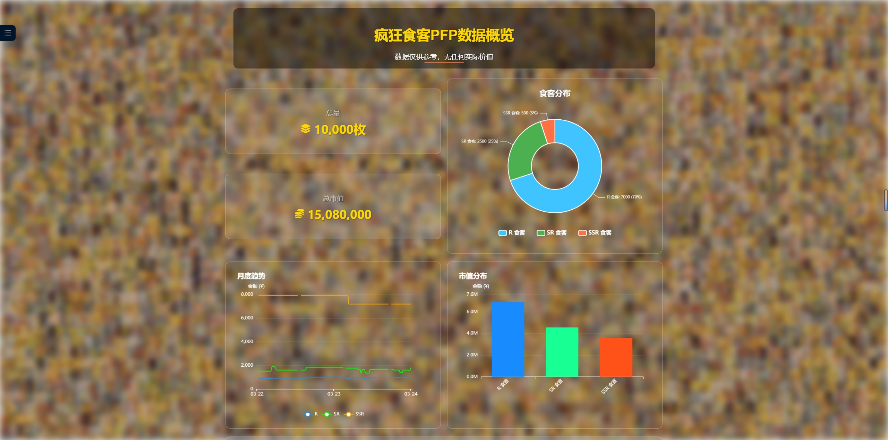
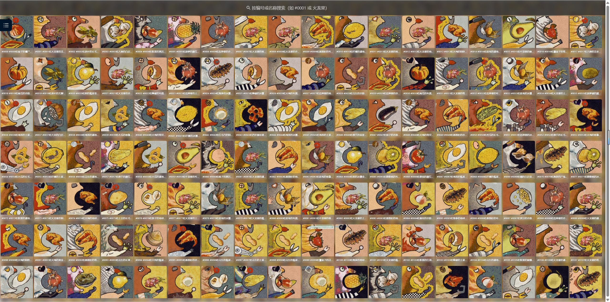

### 介绍
&emsp;&emsp;dashboard一个基于 React 和 TypeScript 开发的疯狂食客藏品展示与分析平台，专注于“疯狂食客”系列的 NFT 数据分析、藏品展示和社区互动。项目通过折线图、柱状图、饼图展示藏品的市值分布、月度趋势和食客分布，通过“食客图谱”展示所有藏品图片，并提供 Q&A 页面和未来的小游戏模块

### 为什么开发这个网站
- 由于疯狂食客官方网站意外下线，所以创建了这个网站，以便更好地向大众展示疯狂食客PFP藏品，让更多人了解和欣赏它们。
### 安装运行
- 在项目目录中，您可以运行.

`npm run build
`
- 将应用程序构建到生产build文件夹中。

`npm start
`
- 您的应用已准备好部署！浏览器如下地址即可查看
http://localhost:3000

### 反馈与建议
如有什么意见需求，请先 star 后提出issues，我会满足你的需求，在我的能力范围内。 issue 没及时看到的，可以关注代理公众号直接发送消息！

### 赞助与支持
&emsp;&emsp;如果您觉得 sk-dashboard 对你有帮助，可以请作者喝杯咖啡。 您的支持是我们更新软件的动力, 谢谢您! (｡･∀･)ﾉﾞ

➡ **[爱发电](https://afdian.com/a/eaterclub)**

### 免责声明
&emsp;&emsp;禁止任何形式的商业用途，包括但不仅限于售卖/打赏/获利，不得使用本代码进行任何形式的牟利/贩卖/传播，再次强调仅供个人私下研究学习技术使用，不提供下载音乐本体！ 本项目仅以纯粹的技术目的去学习研究，如有侵犯到任何人的合法权利，请致信messageoom@gami.com，我将在第一时间修改删除相关代码，谢谢！
